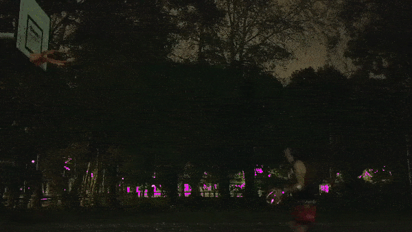
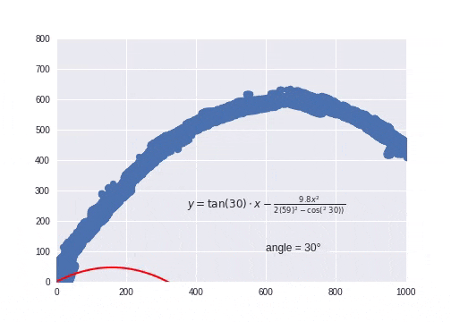

# Optimising Basketball 
## Realtime analysis of basketball with machine learning

### Tech Used
- [Colab](https://colab.research.google.com) for writing the python
- [TensorFlow](https://tensorflow.org)  for custom linear model
- [Keras](https://keras.io/) for building image models
- [TensorFlow.js](https://tensorflow.org/js/) for productionising models to web

https://medium.com/p/a30a923332de/

the 3 interesting notebooks:

[Frame_trails.ipynb](prototype_work/image_trail_v2.ipynb) - where I extract data points from a video file.

[Trajectory_fitting.ipynb](prototype_work/Trajectory_fitting.ipynb) - where I use Tensorflow to fit a trajectory function to the data points extracted.

[Eager_optimising_basketball_shot.ipynb](prototype_work/Eager_optimising_basketball_shot.ipynb) - Using new Eager syntax to do the same task, make ploting data alot easier.

http://www.inpredictable.com/2016/03/free-throw-deep-dives-launch-angle.html?m=1

https://github.com/samdutton/simpl/blob/gh-pages/getusermedia/sources/js/main.js

https://js.tensorflow.org/tutorials/webcam-transfer-learning.html
